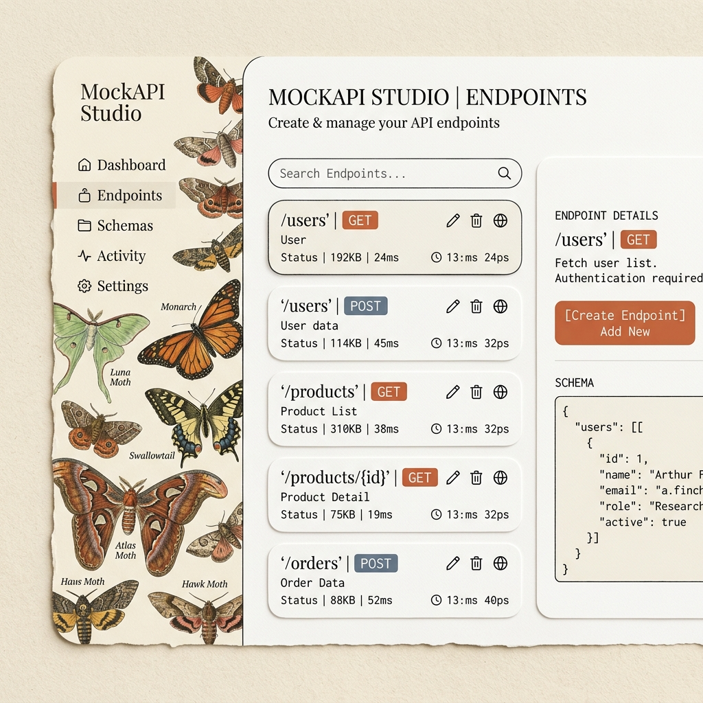

# 📡 MockAPI Studio

> **A Handcrafted, Naturalist Mock API Generator & Client Sandbox**

MockAPI Studio is a 100% client-side developer utility built to design mock endpoints, configure dynamic JSON responses, simulate request latencies, and run test queries in an in-app interactive client. 

Abandoning sterile modern grid lines and harsh neon glows, the interface is designed around a warm **"Organized Chaos" Vintage Lithograph** aesthetic, treating software design with the tactile warmth and care of historical print medium.

---

## 🎨 Visual Preview

### Interface Dashboard Mockup


### Video Demonstration Tour
Below is an interaction recording illustrating endpoint selection, parameter variables updates, simulated latency delays, and timeline log tracing:


---

## ✨ Key Features

*   **Tactile Naturalist Aesthetic**: Styled using custom CSS properties on a warm, antique cotton paper canvas background (`#fbf9f3`), fine ink outlines, high corner roundings (`20px-24px`), and soft, matte stamped HTTP method badges.
*   **Dynamic Variable Engine**: Automatically parses standard placeholders (`{{id}}`, `{{name}}`, `{{email}}`, `{{avatar}}`, `{{company}}`, `{{city}}`, `{{date}}`, etc.) and generates randomized, realistic mock data on each execution.
*   **Organized List Mocking**: Supports loop list expansion patterns (e.g. suffixing a key with `"users|3-6": { ... }` will dynamically generate between 3 and 6 distinct objects with unique details).
*   **Wildcard Path Parameter Binding**: Supports Express-style wildcard variables (e.g. `/api/v1/users/:userId`). The request tester parses the URL variables dynamically and injects the values into your JSON response using `{{params.userId}}`.
*   **Interactive Request Tester (Mini-Postman)**: Build request headers, query strings, or body payloads, hit **"Send"**, watch simulated network delay resolve (up to `3000ms`), and inspect returned status codes, headers, and formatted JSON.
*   **Live Request Timeline logs**: Traces and logs each transaction. Click any card in the logs timeline to expand full request/response headers, body payloads, and size metrics.
*   **One-Click Code Exporters**: Converts your custom mock setups directly into copy-pasteable, zero-dependency Node.js/Express mock servers or standard OpenAPI 3.0 specification documents.

---

## 📖 User Guide: How to Operate

MockAPI Studio is designed to be fully operational without requiring any coding background.

### 1. Navigating and Testing Existing Mocks
1. Select one of the pre-loaded endpoints from the left-side **Endpoints** column (e.g., `GET /api/v1/users/:userId`).
2. Go to the right-side **Request Tester** column. In the **Params** tab, you will see a list of path variables (like `:userId`) and query parameters.
3. Change the value of `:userId` to any text or number (e.g., ` रहमान-123`).
4. Click the terracotta **"Send"** button. The app will pulse with a loading indicator to simulate latency, then render your dynamically populated response (with your custom `:userId` injected into the output!).

### 2. Simulating Network and Server Errors
1. Select an endpoint.
2. In the center column (**Configure Endpoint**), find the **Status Code** input field and type `401` (Unauthorized) or `500` (Internal Server Error).
3. Adjust the **Response Delay** slider to `2000ms`.
4. Click **Send** in the Request Tester. The tester will load for exactly 2 seconds and return your configured error status with a red indicator badge.

### 3. Reviewing Transaction Logs
1. Every request you run is saved in the **Request Logs** timeline at the bottom-right.
2. Click on any log card to open the **Request Details Modal**. This displays the full request context, headers, processing duration, and response payloads.

---

## 🛠️ Local Development & Running

MockAPI Studio compiles with modern Vite tooling and runs entirely in the browser as a static web application.

### Prerequisites
*   Node.js (v18+)
*   NPM

### Setup and Start Dev Server
```bash
# Clone the repository
git clone https://github.com/RahmaanQuresh/-MockAPI-Studio.git
cd -MockAPI-Studio

# Install dependencies
npm install

# Run local development server
npm run dev
```
Open `http://localhost:5173` in your browser to interact with the application.

### Build Production Bundle
```bash
npm run build
```
Vite compiles all compiled assets into the `dist/` directory, ready to be deployed to static hosting providers (such as GitHub Pages or Netlify).
